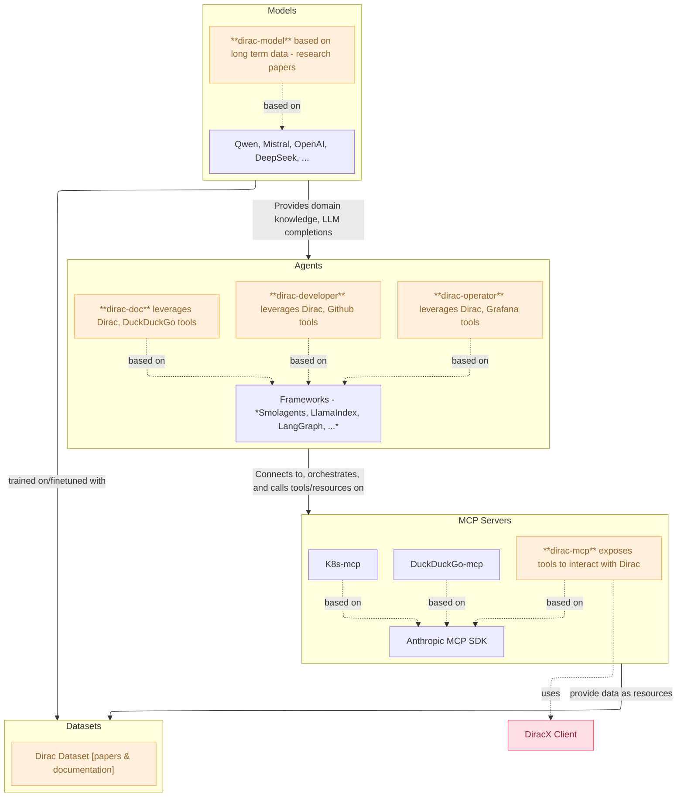

<p align="center">
  
</p>

# Dirac Agentic

This repository is now split into three subprojects:

- **dirac-mcp**: MCP server and related code
- **dirac-agents**: Agents and tool code
- **dirac-model**: Model finetuning tools (based on papers)
- **dirac-dataset**: Tools to load papers, code, documentation into a vector DB





## Development Setup

Each subproject has its own environment. We recommend using [pixi](https://prefix.dev/docs/pixi/) for environment management.

### 1. dirac-mcp

This subproject contains the MCP server and related code. **To interact with the MCP server, you must have a valid `diracx` access token** (usually set in your environment as `DIRACX_CREDENTIALS_PATH` or via your DiracX login). This token is required for authentication and to access the underlying DiracX instance.

#### Contribute

1. Open the `dirac-mcp` folder.
2. Run `pixi install` to create the environment.
4. Run your MCP server as needed, e.g.:

   ```bash
   pixi run dirac-mcp
   ```


#### Run in Copilot Chat

- Open the chat
- Select the `Agent` mode
- Click on `Select tools` and:
  - `Add more tools`
  - `Add MCP Server`
  - `STDIO`

- Copy the following content to `settings.json`:

  ```json
  {
    "mcp": {
      "servers": {
        "diracx": {
          "type": "stdio",
          "command": "docker",
          "args": [
            "run",
            "-i",
            "--rm",
            "-e",
            "DIRACX_URL",
            "-e",
            "DIRACX_CREDENTIALS_PATH",
            "-v",
            "/path/to/.cache/diracx/credentials.json:/tmp/credentials.json",
            "dirac-mcp:latest"
          ],
          "env": {
            "DIRACX_URL": "https://diracx-cert.app.cern.ch",
            "DIRACX_CREDENTIALS_PATH": "/tmp/credentials.json"
          }
        }
      }
    }
  }
  ```

- Log in your diracx instance
- Start chatting about diracx

**Examples:**
- I want to create a diracx job that executes `echo "hello world". Can you do it for me?
- Can you give me the latest failed jobs from diracx?

### 2. dirac-agents

This subproject is focused on building agents that interact with existing MCP servers (such as `dirac_mcp`) and other components. It provides agent logic, tool integration, and the ability to connect to and orchestrate workflows using the MCP protocol. You can use it to build advanced agents that leverage both the MCP server and additional tools or APIs.

#### Contribute

1. Open the `dirac-agents` folder.
2. Run `pixi install` to create the environment.

#### Leverage `dirac_mcp` in your agent

The `dirac_agents` code can connect to an MCP server running from `dirac_mcp` using the MCP protocol. For example, see `client.py` in `dirac_agents`:

```python
from smolagents import ToolCollection, CodeAgent, InferenceClientModel
from mcp.client.stdio import StdioServerParameters

model = InferenceClientModel()
server_parameters = StdioServerParameters(command="uv", args=["run", "server.py"])

with ToolCollection.from_mcp(server_parameters, trust_remote_code=True) as tool_collection:
    agent = CodeAgent(tools=[*tool_collection.tools], model=model)
    agent.run("Can you submit a hello world job on diracx for me?")
```

This allows you to develop and run your MCP server and agents independently, but use them together for end-to-end workflows.

### 3. dirac-model

This subproject contains code and tools for finetuning language models, with the goal of integrating general scientific knowledge (from papers and documentation) into the models. The resulting models can be used to enhance agent capabilities and provide more domain-specific knowledge. (Deployment instructions and advanced usage will be added in the future.)

1. Open the `dirac-agents` folder.
2. Run `pixi install` to create the environment.

### 4. dirac-dataset

This subproject provides tools to load research papers, documentation, and code from various sources (such as GitHub repositories and PDFs) into a vector database using LangChain. It supports downloading, parsing, and chunking documents, making them ready for retrieval-augmented generation (RAG) and other AI workflows. The resulting vector DB can be used to enhance search, question answering, and agent capabilities with domain-specific knowledge.
