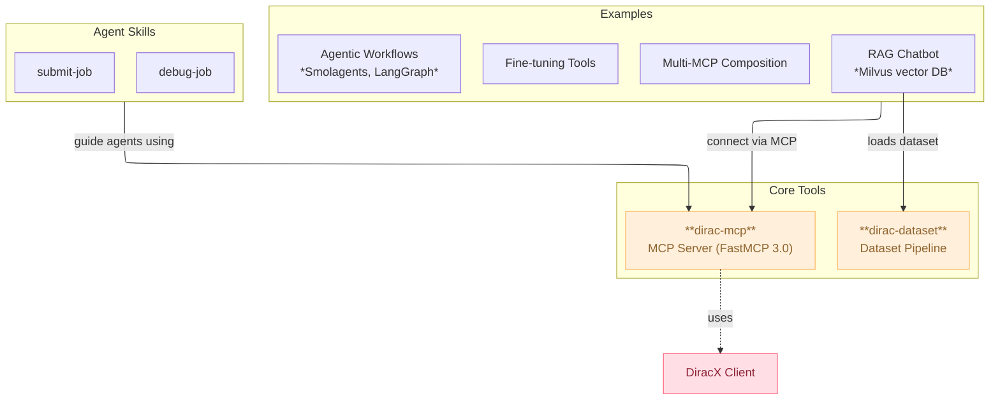

<p align="center">
  
</p>

# Dirac Agentic

Tools to build AI agents for the DIRAC/DiracX distributed computing infrastructure.

## Architecture

**Core tools** (generic, model-agnostic):
- **dirac-mcp** — MCP server exposing DiracX functionality (FastMCP 3.0, stdio + streamable HTTP)
- **dirac-dataset** — Dataset pipeline: papers, docs, code → HuggingFace Dataset

**Examples** (open-source, any model):
- **examples/agentic/** — Agent workflows (Smolagents, LangGraph)
- **examples/rag/** — RAG chatbot with any OpenAI-compatible LLM
- **examples/finetuning/** — QA dataset generation for model fine-tuning
- **examples/multi-mcp/** — Multi-MCP server composition

**Skills** (open standard):
- **.agents/skills/** — Vendor-neutral skill definitions ([agentskills.io](https://agentskills.io) spec)



## Quick Start

### 1. Set up environments

```bash
# Install pixi (https://prefix.dev)
pixi install
```

### 2. Run the MCP server

```bash
# stdio mode (for IDE integration)
pixi run -e dirac-mcp dirac-mcp

# Streamable HTTP mode (for web deployment)
pixi run -e dirac-mcp mcp-http

# Development inspector
pixi run -e dirac-mcp mcp-dev
```

### 3. Generate the dataset

```bash
# Generate a HuggingFace dataset from DIRAC sources
pixi run -e dirac-dataset gen-dataset

# Optionally push to HuggingFace Hub
pixi run -e dirac-dataset push-to-hub ./my_dataset --repo-id myorg/dirac-docs
```

### 4. Run examples

Each example directory has its own `requirements.txt` and `README.md`:

```bash
cd examples/rag
pip install -r requirements.txt
python rag_chatbot.py
```

## MCP Server Integration

### VS Code / Copilot Chat

Add to your `settings.json`:

```json
{
  "mcp": {
    "servers": {
      "diracx": {
        "type": "stdio",
        "command": "docker",
        "args": [
          "run", "-i", "--rm",
          "-e", "DIRACX_URL",
          "-e", "DIRACX_CREDENTIALS_PATH",
          "-v", "/path/to/.cache/diracx/credentials.json:/tmp/credentials.json",
          "dirac-mcp:latest"
        ],
        "env": {
          "DIRACX_URL": "https://diracx-cert.app.cern.ch",
          "DIRACX_CREDENTIALS_PATH": "/tmp/credentials.json"
        }
      }
    }
  }
}
```

### Docker

```bash
docker build -f dirac-mcp/Dockerfile .
docker run -p 8080:8080 \
  -e DIRACX_URL=https://diracx-cert.app.cern.ch \
  -e DIRACX_CREDENTIALS_PATH=/tmp/credentials.json \
  -v /path/to/credentials.json:/tmp/credentials.json \
  dirac-mcp:latest
```

## Development

```bash
# Run tests
pixi run -e dirac-mcp test-mcp
pixi run -e dirac-dataset test-dataset

# Type checking
pixi run -e dirac-mcp mypy-mcp
pixi run -e dirac-dataset mypy-dataset

# Linting & formatting
pre-commit run --all-files
```

## Authentication

DiracX operations require valid credentials:
- Set `DIRACX_URL` to your DiracX instance URL
- Set `DIRACX_CREDENTIALS_PATH` to your credentials file path
- Log in to your DiracX instance before using the MCP server
