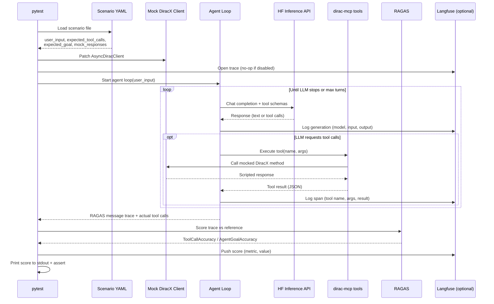

# Evaluation Harness

Two-layer evaluation framework for **dirac-mcp** tools and agent workflows,
using [RAGAS](https://docs.ragas.io/) metrics.

## Scope

This harness evaluates the 9 tool functions exposed by `dirac-mcp` (search,
submit, debug jobs). It does **not** cover higher-level orchestration like the
LangGraph multi-agent example — that would need its own mocking for multiple
MCP servers and the supervisor layer.

## Architecture

```
eval/
├── scenarios/              # YAML scenario definitions (8 scenarios)
├── src/dirac_eval/
│   ├── scenario.py         # Pydantic models + YAML loader
│   ├── mock_client.py      # AsyncDiracClient mock factory
│   └── langfuse_utils.py   # Conditional Langfuse wrapper (no-op without creds)
└── test/
    ├── test_tool_execution.py   # Layer 1: tool tests (no LLM)
    └── test_agent_eval.py       # Layer 2: RAGAS agent eval (needs LLM)
```

### Evaluation Flow (Layer 2)



## Layer 1: Tool Execution Tests

Calls each tool function directly with mocked `AsyncDiracClient` responses.
Validates response format, success status, and expected data fields.

**No LLM required. Runs in CI.**

```bash
pixi run -e eval test-eval
```

## Layer 2: Agent Evaluation (RAGAS)

An LLM agent receives a natural-language task, picks and calls tools against
the mocked DiracX client, and the resulting trace is scored with two RAGAS metrics:

### ToolCallAccuracy

Compares the agent's actual tool calls (names + arguments) against a reference
trajectory from the scenario YAML using **deterministic exact matching**. The LLM
is only used to run the agent loop, not to judge the results.

- Scores 1.0 when the agent calls the same tools with the same arguments as the reference.
- Scores 0.0 when tool names or arguments don't match.

### AgentGoalAccuracy

An **LLM-as-judge** metric. After the agent finishes, a second LLM call evaluates
whether the overall conversation achieved the stated goal (e.g. "Return a list of
jobs with Status=Failed"). Uses RAGAS `AgentGoalAccuracyWithReference` which
requires structured output via [instructor](https://python.useinstructor.com/).

- Scores 1.0 when the judge LLM determines the goal was fully achieved.
- Scores 0.0 when the goal was not met.

## Running Layer 2

Requires a HuggingFace token with Inference API access:

```bash
export HF_TOKEN=hf_...
pixi run -e eval test-eval
```

### Environment Variables

| Variable | Required | Default | Description |
|---|---|---|---|
| `HF_TOKEN` | Yes (Layer 2) | — | HuggingFace API token. Layer 2 tests skip if not set. |
| `EVAL_AGENT_MODEL` | No | `Qwen/Qwen3-14B` | Model for the agent loop. Must support tool/function calling. |
| `EVAL_JUDGE_MODEL` | No | Same as `EVAL_AGENT_MODEL` | Model for the RAGAS judge. Must support structured output. |

The agent and judge models are configured independently so you can use a
smaller, cheaper model for the agent loop while keeping a more capable model
for the judge (or vice versa).

### Model Requirements

| Role | Capability Needed | Interface |
|---|---|---|
| **Agent** | Tool/function calling | `huggingface_hub.InferenceClient` |
| **Judge** (ToolCallAccuracy) | Text generation (any) | OpenAI-compatible via `router.huggingface.co/v1` |
| **Judge** (AgentGoalAccuracy) | Structured output (`instructor`) | OpenAI-compatible via `router.huggingface.co/v1` |

Models are accessed through [HF Inference Providers](https://huggingface.co/docs/inference-providers)
(serverless, pay-per-token via your HF account).

### Tested Models

| Model | Size | `search_jobs_basic` | Notes |
|---|---|---|---|
| `Qwen/Qwen3-14B` | 14B | **1.00** | **Default.** Best cost/accuracy tradeoff. Handles complex nested schemas. |
| `Qwen/Qwen3-32B` | 32B | 0.00 | Valid JSON but wrong arguments. 5 providers. |
| `Qwen/Qwen2.5-72B-Instruct` | 72B | 1.00 | Original baseline. Accurate but expensive. |
| `meta-llama/Llama-3.1-8B-Instruct` | 8B | crash | Serializes nested args as strings. Too small for complex schemas. |

No Mistral models (7B, Nemo-12B, Small-24B) are currently deployed on
HF Inference Providers. The only available Mistral is
`Mixtral-8x22B-Instruct-v0.1` (176B MoE).

### API Usage and Quotas

| Metric | LLM Calls per Scenario | Notes |
|---|---|---|
| ToolCallAccuracy | 2-5 | Agent loop only (multi-turn tool calling) |
| AgentGoalAccuracy | 2-5 + 1 | Agent loop + 1 judge call (structured output) |

A full run of all 8 scenarios with both metrics makes ~40-50 LLM calls. With
Qwen3-14B the cost per run is minimal. Options if budget is a concern:

- **Run selectively** — use `-k` to run specific scenarios:
  `pytest test/test_agent_eval.py -k "search_jobs_basic"`
- **Self-hosted model** — any OpenAI-compatible endpoint works (Ollama, vLLM,
  TGI). Set `EVAL_AGENT_MODEL` / `EVAL_JUDGE_MODEL` accordingly and point the
  code at your local endpoint.

### Using a Different Provider

The agent loop uses `huggingface_hub.InferenceClient` (HF-native). The RAGAS
judge uses the OpenAI-compatible API at `router.huggingface.co/v1`. To use a
different provider (e.g. OpenAI, Anthropic, a local Ollama instance), modify
`_make_judge_llm()` and `_run_agent_loop()` in `test_agent_eval.py`.

## Scenarios

Scenarios are YAML files in `eval/scenarios/` covering the three skills
defined in `.agents/skills/`:

| Scenario | Skill | Description |
|---|---|---|
| `search_jobs_basic` | search-jobs | Search for failed jobs |
| `search_jobs_multi_filter` | search-jobs | Search with multiple conditions |
| `search_jobs_status_summary` | search-jobs | Get job status overview |
| `submit_job_simple` | submit-job | Submit an echo job |
| `submit_job_with_sandbox` | submit-job | Submit with input/output sandboxes |
| `debug_job_failed` | debug-job | Investigate a failed job |
| `debug_job_stalled` | debug-job | Find and kill stalled jobs |
| `debug_job_reschedule` | debug-job | Reschedule failed jobs |

### Adding a Scenario

Create a YAML file in `eval/scenarios/` following this schema:

```yaml
name: my_scenario
skill: search-jobs          # skill name from .agents/skills/
description: What this tests
user_input: "Natural language task for the agent"
expected_goal: "What the agent should achieve"

expected_tool_calls:
  - name: tool_name
    args:
      param: value

mock_responses:
  tool_name:
    return_value:
      # Scripted response data (see existing scenarios for structure)
    side_effect: null       # Optional: exception message string
```

The test is automatically parametrized — new YAML files are picked up without
code changes.

## Langfuse Integration (Optional)

[Langfuse](https://langfuse.com/) is an open-source LLM observability platform
that provides persistent trace storage, visual trace inspection, and score
time-series dashboards.

When enabled, each eval run:
- Creates a **trace** per test with the full agent loop (LLM generations + tool calls)
- Attaches **RAGAS scores** (ToolCallAccuracy, AgentGoalAccuracy) to each trace
- Stores **metadata** (scenario name, skill, model names) for filtering and grouping

### Enabling Langfuse

Set the following environment variables before running tests:

| Variable | Required | Default | Purpose |
|---|---|---|---|
| `LANGFUSE_SECRET_KEY` | No | *(disables Langfuse)* | Langfuse secret key |
| `LANGFUSE_PUBLIC_KEY` | If above is set | — | Langfuse public key |
| `LANGFUSE_BASE_URL` | If self-hosting | `https://cloud.langfuse.com` | Langfuse server URL |

```bash
# Install langfuse in the eval environment (not in pixi.toml due to
# packaging version conflict with fastmcp)
pixi run -e eval pip install 'langfuse>=2.0,<3.0'

export LANGFUSE_SECRET_KEY=sk-lf-...
export LANGFUSE_PUBLIC_KEY=pk-lf-...
export HF_TOKEN=hf_...
pixi run -e eval test-eval
```

### Without Langfuse

Everything works exactly as before — scores print to stdout. No Langfuse
import is triggered unless `LANGFUSE_SECRET_KEY` is set.

### Self-hosted vs Cloud

- **Cloud** (free tier): 50k observations/month at `cloud.langfuse.com`
- **Self-hosted**: Docker Compose with Postgres + ClickHouse + Redis; set
  `LANGFUSE_BASE_URL` to your instance URL

## Baseline Results

Historical results from `Qwen/Qwen2.5-72B-Instruct` via HF Inference Providers
(March 2026). The default model has since been changed to `Qwen/Qwen3-14B`
which scored 1.00 on `search_jobs_basic` (matching the 72B baseline). Full
baselines with the 14B model should be collected and added below.

### After tool schema improvements (v2)

Added enum constraints, detailed descriptions, and workflow hints to tool
schemas. Key improvement: operator field now has an explicit enum
(`eq`, `neq`, `gt`, etc.) instead of a bare string.

| Scenario | ToolCallAccuracy | AgentGoalAccuracy |
|---|---|---|
| debug_job_failed | 0.00 – 1.00 | 1.00 |
| debug_job_reschedule | 0.50 | — |
| debug_job_stalled | 0.50 | — |
| search_jobs_basic | **1.00** | — |
| search_jobs_multi_filter | — | — |
| search_jobs_status_summary | 1.00 | 1.00 |
| submit_job_simple | 0.17 | — |
| submit_job_with_sandbox | — | — |

### Initial baseline (v1)

| Scenario | ToolCallAccuracy | AgentGoalAccuracy |
|---|---|---|
| debug_job_failed | 0.00 – 1.00 | 1.00 |
| debug_job_reschedule | 0.50 | — |
| debug_job_stalled | 0.50 | — |
| search_jobs_basic | 0.00 | — |
| search_jobs_multi_filter | 0.00 | — |
| search_jobs_status_summary | 1.00 | 1.00 |
| submit_job_simple | 0.00 | — |
| submit_job_with_sandbox | 0.12 | — |

**Notes:**
- ToolCallAccuracy uses strict exact matching. Low scores often mean the agent
  used a slightly different argument format rather than a fundamentally wrong
  tool choice.
- AgentGoalAccuracy results marked "—" were not collected (HF quota exhausted
  before those scenarios ran). The metric is confirmed working.
- Results vary between runs due to LLM non-determinism.
