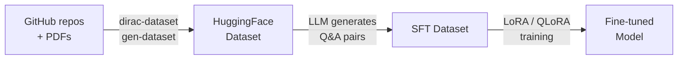
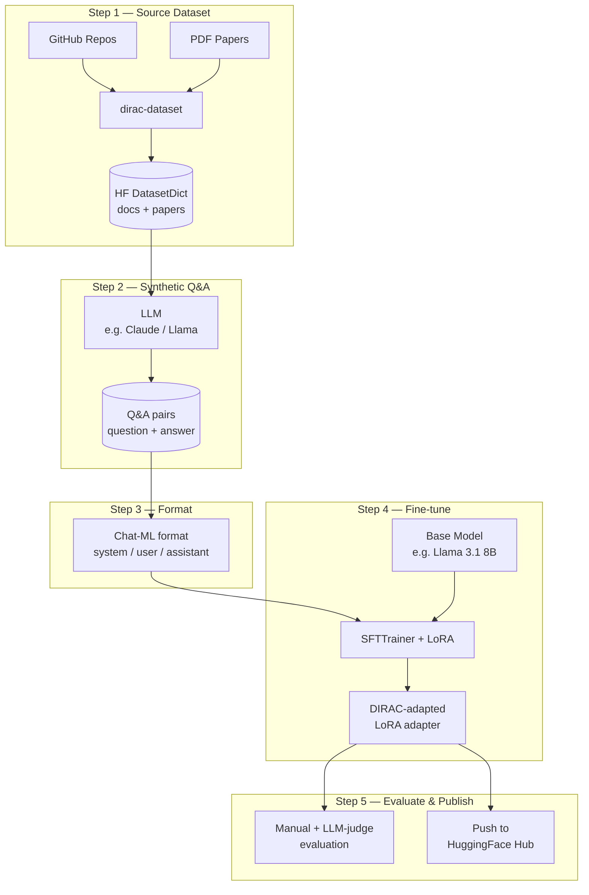

# Fine-tuning with DIRAC Domain Knowledge

This guide describes how to fine-tune a language model on DIRAC/DiracX documentation using the `dirac-dataset` pipeline and HuggingFace tools. No runnable code is provided -- this is a reference for building your own fine-tuning workflow.

## Overview

The goal is to take a pre-trained LLM and specialise it on DIRAC domain knowledge so it can answer questions about job management, workload scheduling, data management, and other DIRAC concepts.





## Step 1: Generate the source dataset

Use `dirac-dataset` to build a HuggingFace Dataset from DIRAC documentation and papers.

```bash
# From the repository root
pixi run -e dirac-dataset gen-dataset \
  --repos-file data/repos.json \
  --pdfs-file data/pdfs.json \
  --out ./dirac_dataset
```

This produces a `DatasetDict` saved to disk with two splits:

| Split    | Content                              |
|----------|--------------------------------------|
| `docs`   | Chunked markdown/RST from GitHub repos |
| `papers` | Chunked text from PDF papers         |

Each record has a `text` field (the chunk) plus source metadata.

You can also push it to the HuggingFace Hub for reuse:

```bash
pixi run -e dirac-dataset push-to-hub ./dirac_dataset --repo-id myorg/dirac-docs
```

## Step 2: Generate synthetic Q&A pairs

The raw chunks from Step 1 are not directly suitable for supervised fine-tuning -- you need (instruction, response) pairs. The standard approach is to use an LLM to generate synthetic Q&A pairs from each chunk.

### What you need

- An LLM for generation (cloud API or local model)
- A prompt template that asks the model to produce Q&A pairs from a documentation chunk
- Validation logic to parse and filter the generated pairs

### Approach

```python
from datasets import DatasetDict, Dataset

# Load the dataset from Step 1
ds = DatasetDict.load_from_disk("./dirac_dataset")

# For each chunk, generate Q&A pairs using an LLM
qa_pairs = []
for split in ds.values():
    for record in split:
        chunk = record["text"]
        # Call your LLM with a prompt like:
        # "Given this DIRAC documentation, generate question-answer pairs
        #  that test understanding of the concepts described.
        #  Return JSON: [{"question": "...", "answer": "..."}]"
        #
        # Parse the response and collect pairs
        qa_pairs.extend(generate_qa(chunk))

# Save as a new HuggingFace Dataset
qa_dataset = Dataset.from_list(qa_pairs)
qa_dataset.save_to_disk("./dirac_qa_dataset")
```

### Tips

- **Model choice**: A capable model (e.g. Claude, GPT-4, Llama 3 70B) produces higher-quality pairs. Smaller models (Qwen 2.5 0.5B, Llama 3 8B) work but need more filtering.
- **Validation**: Use Pydantic or JSON schema validation to discard malformed outputs.
- **Deduplication**: Remove near-duplicate questions using embedding similarity.
- **Quality filtering**: Discard pairs where the answer is too short, too generic, or not grounded in the source chunk.

## Step 3: Format for training

Convert Q&A pairs into the chat format expected by your target model. Most SFT frameworks (TRL, Axolotl) expect a `messages` column in chat-ml format.

```python
def format_for_sft(qa_pair):
    return {
        "messages": [
            {"role": "system", "content": "You are an expert in DIRAC distributed computing middleware."},
            {"role": "user", "content": qa_pair["question"]},
            {"role": "assistant", "content": qa_pair["answer"]},
        ]
    }

sft_dataset = qa_dataset.map(format_for_sft)
sft_dataset.push_to_hub("myorg/dirac-sft")
```

## Step 4: Fine-tune

Use a framework like [TRL](https://huggingface.co/docs/trl) (recommended) or [Axolotl](https://github.com/axolotl-ai-cloud/axolotl) to run supervised fine-tuning with LoRA/QLoRA.

### Example with TRL

```python
from datasets import load_dataset
from trl import SFTConfig, SFTTrainer
from transformers import AutoModelForCausalLM, AutoTokenizer
from peft import LoraConfig

model_id = "meta-llama/Llama-3.1-8B-Instruct"
dataset = load_dataset("myorg/dirac-sft")

# LoRA configuration for parameter-efficient fine-tuning
peft_config = LoraConfig(
    r=16,
    lora_alpha=32,
    lora_dropout=0.05,
    target_modules=["q_proj", "v_proj", "k_proj", "o_proj"],
    task_type="CAUSAL_LM",
)

training_args = SFTConfig(
    output_dir="./dirac-llama-lora",
    num_train_epochs=3,
    per_device_train_batch_size=4,
    gradient_accumulation_steps=4,
    learning_rate=2e-4,
    bf16=True,
    logging_steps=10,
    save_strategy="epoch",
)

trainer = SFTTrainer(
    model=model_id,
    args=training_args,
    train_dataset=dataset["train"],
    peft_config=peft_config,
)

trainer.train()
trainer.save_model("./dirac-llama-lora")
```

### Key dependencies

```
datasets
torch
transformers
peft
trl
bitsandbytes  # for QLoRA (4-bit quantization)
```

## Step 5: Evaluate and publish

- **Manual evaluation**: Ask DIRAC-specific questions and compare base vs. fine-tuned responses.
- **Automated evaluation**: Use a judge LLM to score answer quality on a held-out test set.
- **Publish**: Push the LoRA adapter to HuggingFace Hub with `model.push_to_hub()`.

## Resources

- [TRL documentation](https://huggingface.co/docs/trl) -- SFTTrainer, DPO, RLHF
- [PEFT documentation](https://huggingface.co/docs/peft) -- LoRA, QLoRA adapters
- [HuggingFace Dataset guide](https://huggingface.co/docs/datasets) -- loading, processing, pushing datasets
- [Axolotl](https://github.com/axolotl-ai-cloud/axolotl) -- YAML-based fine-tuning framework
